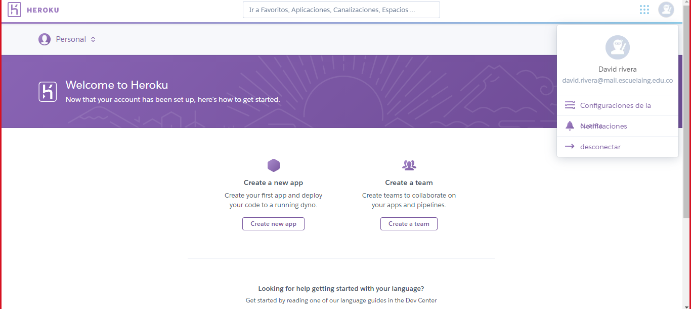

# LAB6

**********************************************************
----------------------------------------------------------
**********************************************************
# LAB6-CVDS

### Datos básicos
 * **Nombres:** David Fernando Rivera\
				Janer Stiven Vanegas
				
				
**********************************************************
----------------------------------------------------------
**********************************************************

# Parte I. Integración continua
Ingrese al repositorio de WebApp-Heroku-CircleCI-CI en GitHub y resuelva el laboratorio allí especificado usando el proyecto creado en el  Laboratorio 5 - MVC Primefaces Introduction - 2020-2.
1. Creacion de usuarios Heroku.
	* David Rivera
		
		0eee862c-5c7e-4123-a7c0-7986337d383c
**********************************************************

## Parte II. Interfaz Gráfica
Agregue mayor detalle a la interfaz gráfica de la página web para que se vea más amigable al usuario. Busque y agregue estilos, colores de fondo, títulos, centrar la página, etc. cualquier elemento o detalle que pueda mejorar cómo se ve la página y como el usuario la percibe.

Si no recuerda cómo hacerlo, puede revisar la información disponible en W3Schools para HTML y CSS.

